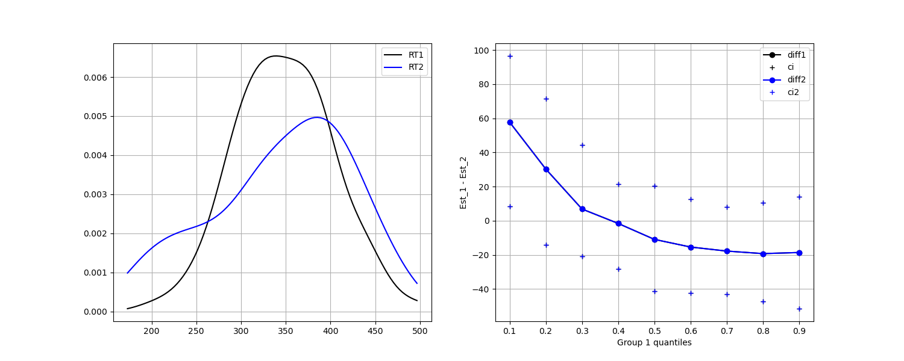

# wilcox_quantiles

Compare multiple quantiles from 2 distributions simultaneously using Wilcox et al. 2013 method.

This is a Python translation of one of the Wilcox' Robust Statistics (WRS) functions from an [R package](https://github.com/nicebread/WRS).

# Dependencies

+ numpy
+ scipy
+ (optional, for plotting only) matplotlib

# Usage

Example:

```python
import numpy as np
from wilcox_quantile import compare_quantiles_vec

rt1 = np.random.randn(100) * 52 + 350
rt2 = np.r_[np.random.randn(85) * 55 + 375, np.random.randn(15) * 25 + 220]
comp = compare_quantiles_vec(rt1, rt2, quantiles=np.arange(0.1, 1.0, 0.1))
```

See the full example in `example.py`.

Output figure:




# Reference

+ The paper: Rand R. Wilcox , David M. Erceg-Hurn, Florence Clark & Michael Carlson,
Journal of Statistical Computation and Simulation (2013): Comparing two independent groups
via the lower and upper quantiles, Journal of Statistical Computation and Simulation, DOI:
10.1080/00949655.2012.754026

+ The R code: https://raw.githubusercontent.com/nicebread/WRS/master/pkg/R/Rallfun-v39.R

+ An blog post on the subject: http://www.nicebread.de/comparing-all-quantiles-of-two-distributions-simultaneously/
